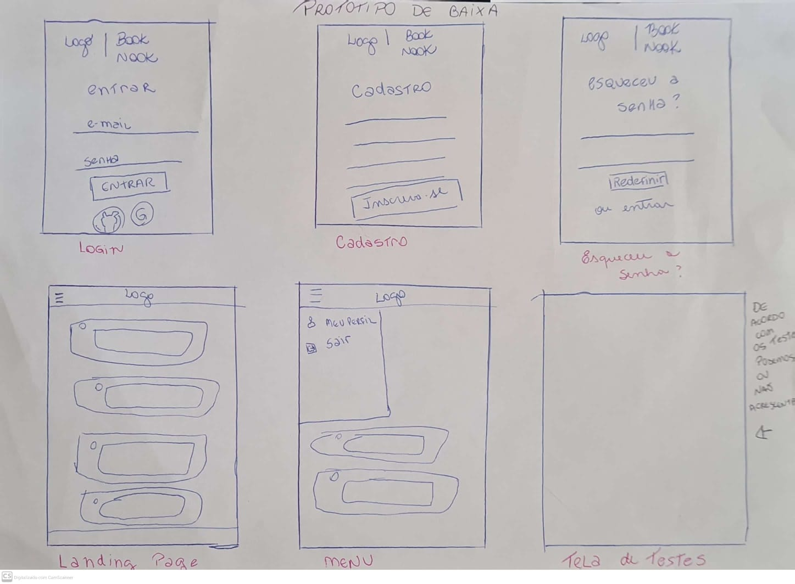

# Criando uma Rede Social

## Índice

* [1. Resumo do Projeto](#1-Resumo-do-Projeto)
* [2. Definição do Produto](#2-definição-do-produto)
* [3. História de usuário](#3-história-de-usuario)
* [4. Objetivos de aprendizagem](#4-objetivos-de-aprendizagem)
* [5. Protótipos](#5-prototipos)
* [6. Desenvolvedoras](#6-desenvolvedoras)
* [7. Tecnologias Utilizadas](#7-tecnologias-utilizadas)

***

## 1. Resumo do Projeto

BookNook é uma rede social dedicada aos amantes de livros. Aqui, os usuários podem compartilhar suas experiências de leitura e visualizar posts de outros leitores, e muito mais.

<strong>Compartilhamento de Experiências:</strong> Os usuários podem postar sobre suas experiências de leitura, compartilhando suas opiniões e pensamentos sobre os livros que leram.

<strong>Interação com Posts:</strong> Os usuários podem visualizar posts de outros usuários, permitindo uma troca rica e significativa de ideias e opiniões.

<strong>Perfil Personalizado:</strong> Cada usuário pode criar um perfil personalizado, que inclui informações pessoais. Isso permite que os usuários se conectem com outros leitores que têm interesses semelhantes.

## 2. Definição do Produto 

<strong>Quem são os principais usuaários do produto?</strong> Seja você um ávido leitor ou alguém que está apenas começando sua jornada literária, o BookNook é o lugar perfeito para você se conectar com outros amantes de livros e compartilhar suas experiências de leitura.

<strong>Qual o problema o produto resolve/para que ele serve para esses usuários?</strong> O produto resolve o problema e atende as necessidades do usuário da seguinte maneira:

1- Comunidade de Leitores: Muitas vezes, os leitores desejam compartilhar suas experiências de leitura, discutir ideias e trocar opiniões sobre livros. No entanto, pode ser difícil encontrar uma comunidade de leitores na vida real. O BookNook serve como uma plataforma onde os amantes de livros podem se conectar e interagir uns com os outros. 

2- Recomendações Personalizadas: Com base nas informações do perfil do usuário e nos gêneros literários postados, o BookNook pode fornecer  através dos seus usuários recomendações de livros personalizadas. Isso resolve o problema de ter que procurar por novos livros para ler.

3- Registro de Leitura: Os usuários podem usar o BookNook para manter um registro de suas experiências de leitura. Isso pode servir como um diário pessoal ou uma maneira de lembrar detalhes importantes sobre os livros que leram.

Seja qual for a finalidade, o produto serve para fornecer informações úteis para os amantes de livros, atendendo as necessidades especificas de cada usuário. 

## 3. História de Usuário 

Atendendo as necessidades dos usuário, elaboramos alguns testes de usabilidade e o que eles desejam encontrar nessa rede social. 

 * #### História de usuário 1: Cadastro do Leitor
  Leitor deseja criar uma conta na rede social para ter acesso aos recursos e interagir com outros amantes de livros.
 * #### Critérios de aceitação: 
- O leitor deve fornecer um nome de usuário, endereço de e-mail e senha para criar a conta.
- O sistema deve validar se o endereço de e-mail é único e se a senha é válida.
- Após o cadastro bem-sucedido, o leitor deve conseguir fazer login com o email e a senha.
 * #### Definição de produto:
- A funcionalidade passou por testes manuais buscando erros e imperfeições.
- A funcionalidade passou por testes de usabilidade e o feedback dos usuários foi incorporado como melhorias.
- A funcionalidade foi revisada por um membro de outra equipe.

* #### História de Usuário 2: Login
O leitor cadastrado deseja fazer login na rede social usando uma conta Google para acessar suas informações e interagir com outros .
 * #### Critérios de aceitação:
- Deve conseguir acessar a aplicação com o login Google através de uma pop-up/modal.
- O sistema deve verificar se as credenciais são válidas e permitir o acesso ao perfil.
 * #### Definição de pronto:
- O leitor pode fazer login na rede social e acessar seu perfil.
- A funcionalidade passou por testes manuais buscando erros e imperfeições.
- A funcionalidade passou por testes de usabilidade e o feedback dos usuários foi incorporado como melhorias.
- A funcionalidade foi revisada por um membro de outra equipe.

 * #### História de Usuário 3: Compartilhamento de Experiências
O leitor deseja compartilhar experiências de suas leituras e obter indicações de outros leitores.
* #### Critérios de aceitação:
- O usuário deve poder criar postagens para compartilhar suas experiências e insights relacionados a suas leituras.
- O sistema deve permitir o usuário consiga editar um post criado.
- O usuário deve poder excluir do feed um post escrito por ele anteriormente.
 * #### Definição de pronto:
- O usuário pode criar postagens e visualizar postagens de outros usuários no feed.
- O usuário pode editar seus posts ou excluí-los. 
- A funcionalidade passou por testes manuais buscando erros e imperfeições.
- A funcionalidade passou por testes de usabilidade e o feedback dos usuários foi incorporado como melhorias.
- A funcionalidade foi revisada por um membro de outra equipe através de code review.

 ## 4. Objetivos de aprendizagem

✓ Uso de HTML 

✓ Uso de seletores de CSS

✓ Uso de seletores de DOM

✓ Testes assíncronos

✓ Firebase

✓ Firestore

✓ Single Page Application (SPA)

## 5. Protótipos

### Baixa Fidelidade

### Alta Fidelidade

## 6. Desenvolvedoras

<strong>Gabriella Vieira Bruno</strong>  [Linkedin](https://www.linkedin.com/in/gabriellavieirabruno/)

<strong>Crystine Iokman</strong> [Linkedin](https://www.linkedin.com/in/crystine-iokman/)

<strong>Laís Costa</strong> [Linkedin](https://www.linkedin.com/in/laiscostac/)

## 7. Tecnologias Utilizadas

   
